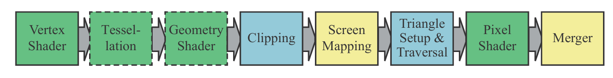

### 这是基于[tinyrenderer](https://github.com/ssloy/tinyrenderer "tinyrenderer")实现的cpu渲染

### 以下是渲染原理要点

### 齐次坐标和各种变换

**齐次坐标**是一种扩展的坐标表示法，用于方便描述和计算仿射变换和投影变换

* 在二维空间中，一个点 (x,y)(x, y)**(**x**,**y**)** 的齐次坐标表示为 (x,y,w)，其中 w≠0
* 在三维空间中，一个点 (x,y,z)(x, y, z)**(**x**,**y**,**z**)** 的齐次坐标表示为 (x,y,z,w)，其中 w≠0
* 实际坐标通过除以 w 得到

#### 各种变换（以二维坐标系为例）

**缩放变换**：x->a×x,y->b×y

$$
\begin{bmatrix}
a & 0 \\
0 & b
\end{bmatrix}
$$

**旋转矩阵**：绕原点转θ度

$$
\begin{bmatrix}
\cos\theta & -\sin\theta \\
\sin\theta & \cos\theta
\end{bmatrix}
$$

**剪切变换**：沿着某个轴“倾斜”

$$
\begin{bmatrix}
1 & k \\
0 & 1
\end{bmatrix}
$$

**为什么需要使用齐次坐标？**

**平移变换**：x->x+a,y->y+b

显然无法用2*2矩阵表达，因为并非线性

通过齐次坐标，把平移因子[a,b,1]作为新的一列，转化成线性变换

$$
\begin{bmatrix}
1 & 0 & a \\
0 & 1 & b \\
0 & 0 & 1
\end{bmatrix}
\begin{bmatrix}
x \\
y \\
1
\end{bmatrix}
=
\begin{bmatrix}
x + a \\
y + b \\
1
\end{bmatrix}
$$

**仿射变换** 是一种包括线性变换（旋转、缩放、剪切）和**平移**的组合变换。

### 六种空间和五种变换

**模型空间坐标系（Model Space）**

​        ↓**模型变换（Model Transformation）**：负责将物体从模型坐标系（局部坐标系）变换到世界坐标系

**世界坐标系（World Space）**

​        ↓**视图变换（View Transformation）**：负责将世界坐标系转换到相机坐标系（观察者坐标系）

**相机坐标系（Camera Space）**

​        ↓**投影变换（Projection Transformation）**：负责将相机坐标系中的三维场景投影到裁剪空间

**裁剪空间坐标系**:裁剪空间是图形管线中顶点经过投影变换后得到的坐标空间，顶点以齐次坐标形式表示（x, y, z, w）。在这个空间内，顶点会被裁剪以去除视锥体外的部分，从而优化后续渲染。

​        ↓**透视除法（Perspective Divide）**：将裁剪空间坐标转换为标准化设备坐标（NDC）

**标准化设备坐标系（Normalized Device Coordinates (NDC)）**：标准化设备坐标系是将裁剪空间经过齐次除法（Perspective Divide）后得到的坐标空间，所有坐标都被规范化到 [−1,1]的立方体内。

​        ↓**视窗变换（Viewport Transformation）**：将标准化设备坐标映射到屏幕坐标系

**屏幕空间（Screen Space）**

//todo图解

### 怎样画一条直线

#### Bresenham’s Line Drawing Algorithm

是一个经典的  **栅格化直线绘制算法** ，用于在像素网格中高效地绘制一条近似直线。它以  **整数运算为主** ，效率很高，广泛用于图形学与嵌入式图形显示。

//TODO图解

### 怎样绘制一个三角面：三角形光栅化

#### Old-school method: Line sweeping(传统派王源)

是在现代光栅化技术（如 barycentric 插值、GPU 流程）出现前，**用扫描线逐行填充三角形的方法**

#### 原理概述：Line Sweeping Rasterization

给定一个三角形三个顶点 `v0(x0, y0)`、`v1(x1, y1)`、`v2(x2, y2)`，我们按照如下步骤执行：

##### 1. 按 y 坐标排序顶点：

//TODO 图解

此时：

* `v0` 是最上面的点
* `v1` 是中间点
* `v2` 是最下面的点

##### 2. 将三角形分成两个部分：

* **上半部分** ：v0 到 v1
* **下半部分** ：v1 到 v2

每一部分可以看作是两个顶点间的一条扫描线逐步水平填充。

//TODO图解

#### Bounding Box + Barycentric Coordinates(维新派丁真)

基于 **Bounding Box + 重心坐标（Barycentric Coordinates）** 的三角形光栅化，是现代软件渲染器中最常见、也是最优雅的一种方法。它对纹理贴图、Z-buffer、阴影映射等扩展非常友好。

//TODO图解

### 隐藏面剔除(z-buffer)

Z缓冲（Z-buffer）是现代光栅化渲染中最常用的 **隐藏面消除技术** ，用于判断哪个片元（像素）在视点前面、该被显示出来。它解决的是“多个三角形重叠时，前面的遮挡后面的”问题。

Z-buffer 存储每个像素当前的最小深度值（Z 值），每绘制一个像素就判断是否更近，如果更近就更新它，否则丢弃。

//TODO图解

### Shader着色器

#### **GPU渲染管线流程**

主要介绍VertexShader和Pixel Shader(Fragment Shader )

#### **VertexShader** 

**顶点着色器**是图形管线中的一个可编程阶段，负责处理每个顶点的数据。它的主要任务包括：

* 变换顶点坐标（如模型变换、视图变换、投影变换）
* 计算顶点的法线、颜色、纹理坐标等属性
* 输出变换后的顶点位置给后续管线阶段（如图元装配和光栅化）

#### **Pixel Shader** 

**片元着色器（有时也叫像素着色器**）是图形渲染管线中的一个阶段，用于计算每个片元（像素候选点）的最终颜色和其他属性。它通常用于：

* 计算光照效果
* 纹理采样与映射
* 颜色混合与处理
* 透明度和其他像素级效果

### 一个简单的渲染流程

#### 计算变换矩阵

//TODO

#### Vertex Shader里进行坐标变换

//TODO

#### **Pixel Shader**里计算像素颜色

//TODO

### 法线贴图

### 阴影贴图

### 环境光遮蔽
