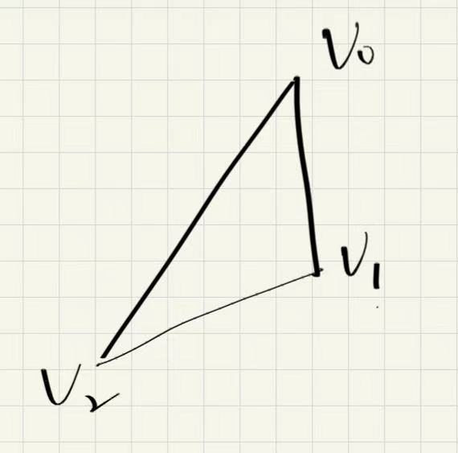

### 这是基于[tinyrenderer](https://github.com/ssloy/tinyrenderer "tinyrenderer")实现的cpu渲染

### 以下是渲染原理要点

### 0.齐次坐标和各种变换

**齐次坐标**是一种扩展的坐标表示法，用于方便描述和计算仿射变换和投影变换

* 在二维空间中，一个点 (x,y)(x, y)**(**x**,**y**)** 的齐次坐标表示为 (x,y,w)，其中 w≠0
* 在三维空间中，一个点 (x,y,z)(x, y, z)**(**x**,**y**,**z**)** 的齐次坐标表示为 (x,y,z,w)，其中 w≠0
* 实际坐标通过除以 w 得到

#### 1.各种变换（以二维坐标系为例）

**缩放变换**：x->a×x,y->b×y

$$
\begin{bmatrix}
a & 0 \\
0 & b
\end{bmatrix}
$$

**旋转矩阵**：绕原点转θ度

$$
\begin{bmatrix}
\cos\theta & -\sin\theta \\
\sin\theta & \cos\theta
\end{bmatrix}
$$

**剪切变换**：沿着某个轴“倾斜”

$$
\begin{bmatrix}
1 & k \\
0 & 1
\end{bmatrix}
$$

**为什么需要使用齐次坐标？**

**平移变换**：x->x+a,y->y+b

显然无法用2*2矩阵表达，因为并非线性

通过齐次坐标，把平移因子[a,b,1]作为新的一列，转化成线性变换

$$
\begin{bmatrix}
1 & 0 & a \\
0 & 1 & b \\
0 & 0 & 1
\end{bmatrix}
\begin{bmatrix}
x \\
y \\
1
\end{bmatrix}
=
\begin{bmatrix}
x + a \\
y + b \\
1
\end{bmatrix}
$$

**仿射变换** 是一种包括线性变换（旋转、缩放、剪切）和**平移**的组合变换。

### 2.六种空间和四种变换

**模型空间坐标系（Model Space）**

    ↓**模型变换（Model Transformation）**：负责将物体从模型坐标系（局部坐标系）变换到世界坐标系

**世界坐标系（World Space）**

    ↓**视图变换（View Transformation）**：负责将世界坐标系转换到相机坐标系（观察者坐标系）

**相机坐标系（Camera Space）**

    ↓**投影变换（Projection Transformation）**：负责将相机坐标系中的三维场景投影到裁剪空间

**裁剪空间坐标系**:裁剪空间是图形管线中顶点经过投影变换后得到的坐标空间，顶点以齐次坐标形式表示（x, y, z, w）。在这个空间内，顶点会被裁剪以去除视锥体外的部分，从而优化后续渲染。

    ↓**透视除法（Perspective Divide）**：将裁剪空间坐标转换为标准化设备坐标（NDC）

**标准化设备坐标系（Normalized Device Coordinates (NDC)）**：标准化设备坐标系是将裁剪空间经过齐次除法（Perspective Divide）后得到的坐标空间，所有坐标都被规范化到 [−1,1]的立方体内。

    ↓**视窗变换（Viewport Transformation）**：将标准化设备坐标映射到屏幕坐标系

**屏幕空间（Screen Space）**

### 3.怎样画一条直线

#### Bresenham’s Line Drawing Algorithm

是一个经典的  **栅格化直线绘制算法** ，用于在像素网格中高效地绘制一条近似直线。它以  **整数运算为主** ，效率很高，广泛用于图形学与嵌入式图形显示。

假设绘制直线[x0,y0]->[x1,y1]，斜率≤1

1. 首先计算误差 dx = x1-x0 dy = y1-y0
2. 设累计误差 p= 2dy-dx
3. 初始化[x,y] = [x0,y0]
4. 从x0->x1，绘制点[x,y]，若p≥0，y+=1,p+=2dy-2dx,否则p=p+2dy

**为什么是2dy-dx?**

抛开这个值不管，考虑用浮点数去描述这个误差，怎么描述呢？想象绘制一个像素就是绘制一段长度为1的直线，而直线斜率为dy/dx，每次累计误差dy/dx，随着x0->x1，为了维持直线的形状，如果累计误差>0.5，就令y+=1，p-=1。看看描述这个条件的不等式：dy/dx≤0.5，即2dy-dx≤0，由于整形运算较快，用这个误差去累计效率更高。

**斜率＞1？**

可以把xy反过来计算误差，绘制时再反过来绘制

### 4.怎样绘制一个三角面：三角形光栅化

#### Old-school method: Line sweeping(传统派王源)

是在现代光栅化技术（如 barycentric 插值、GPU 流程）出现前，**用扫描线逐行填充三角形的方法**

#### 原理概述：Line Sweeping Rasterization

给定一个三角形三个顶点 `v0(x0, y0)`、`v1(x1, y1)`、`v2(x2, y2)`，我们按照如下步骤执行：

##### 1. 按 y 坐标排序顶点：

此时：

* `v0` 是最上面的点
* `v1` 是中间点
* `v2` 是最下面的点

##### 2. 将三角形分成两个部分：

* **上半部分** ：v0 到 v1
* **下半部分** ：v1 到 v2

每一部分可以看作是两个顶点间的一条扫描线逐步水平填充。

注意边缘情况 v1.y = v0. y 和 v1.y = v2.y

#### Bounding Box + Barycentric Coordinates(维新派丁真)

基于 **Bounding Box + 重心坐标（Barycentric Coordinates）** 的三角形光栅化，是现代软件渲染器中最常见、也是最优雅的一种方法。它对纹理贴图、Z-buffer、阴影映射等扩展非常友好。

对绘制的三角形取一个boundingbox，对box内每个像素进行测试，重心坐标xyz都大于0等于的像素就是在三角形里面，需要绘制。

### 隐藏面剔除(z-buffer)

Z缓冲（Z-buffer）是现代光栅化渲染中最常用的 **隐藏面消除技术** ，用于判断哪个片元（像素）在视点前面、该被显示出来。它解决的是“多个三角形重叠时，前面的遮挡后面的”问题。

Z-buffer 存储每个像素当前的最小深度值（Z 值），每绘制一个像素就判断是否更近，如果更近就更新它，否则丢弃。

如图，假设zbuffer中p0对应的像素位置缓存了p0.z，而下回某次绘制，某个p1变换到跟p0一样的像素位置，比较p1.z和缓存值决定是否更新缓存和绘制这个像素。

### 5.Shader着色器

#### **GPU渲染管线流程**

主要介绍VertexShader和Pixel Shader(Fragment Shader )

#### **VertexShader**

**顶点着色器**是图形管线中的一个可编程阶段，负责处理每个顶点的数据。它的主要任务包括：

* 变换顶点坐标（如模型变换、视图变换、投影变换）
* 计算顶点的法线、颜色、纹理坐标等属性
* 输出变换后的顶点位置给后续管线阶段（如图元装配和光栅化）

#### **Pixel Shader**

**片元着色器（有时也叫像素着色器**）是图形渲染管线中的一个阶段，用于计算每个片元（像素候选点）的最终颜色和其他属性。它通常用于：

* 计算光照效果
* 纹理采样与映射
* 颜色混合与处理
* 透明度和其他像素级效果

### 6.一个简单的渲染流程

#### 计算变换矩阵

假设模型不需要变换直接在世界坐标系下渲染

**视图变换**

首先相机有一个向量up，一般朝上，先确定z方向，z=center(视点)-eye(相机位置)，单位化，用z和up叉积求x，单位化，z和x叉积求y，单位化。现在可以构造正交矩阵[x,y,z]，世界坐标系变换到相机坐标系，S=invert(C)*B，C构成相机坐标系的正交标准基即[x,y,z]，B为世界坐标系的标准基为单位阵，正交矩阵的逆为其转置，S=transpose(C)。等等，别忘了相机并不是在原点，坐标变换过去后要减去相机中心center，用齐次坐标描述这个变换，4*4矩阵View，左上3*3块为S，最后一列为[center ,1]

**投影变换**

//TODO

**透视除法**

**视窗变换**

设视窗宽为w，高为h，左下角为[x,y]，则ndc为[-1,1]，应该先x，y方向分别缩放w/2，h/2倍，此时左下角为[-w/2,-h/2]，移动到目标的左下角，移动向量为[w/2+x,h/2+y]

#### Vertex Shader里进行坐标变换

计算输入三角面顶点在裁剪空间的齐次坐标，从世界坐标系到裁剪空间（假设原物体不进行模型变换），变换矩阵为Projection*View，这一步同时获取三个贴图的uv值

#### 栅格化

获取到点在裁剪空间的齐次坐标后，映射到屏幕空间，进行基于 **Bounding Box + 重心坐标（Barycentric Coordinates）** 的三角形光栅化，缓存下重心坐标和三个点映射后的屏幕位置

#### **Pixel Shader里计算像素着色**

用重心坐标插值计算uv和屏幕绘制坐标，通过uv值在贴图取样颜色，在绘制位置像素着色

### 7.法线贴图

**灯光**

在计算光照时，通过求灯光和法向的点积作为光照强度**I**=**max**(**0**,**N**⋅**L**)。

**模型发生了变换？**

如果不进行法线映射，那么模型变换后根据uv取得法向就是不一定正确的。假设变换矩阵是M，模型某个三角面上某个点取到得法向是n，面上一个切向量是v，则n*v = 0，变换后，只要n左乘transpose(invert(M)))就能得到正确法向，推导：

**法线贴图（Normal Mapping）** 是一种图形渲染技术，用于在不增加模型几何细节的前提下，**模拟表面凹凸感** 和细节光照效果。

正常情况下，模型的每个面只有一个平滑法线，用于计算光照。但如果想让一个平面表现得像是有砖块、划痕或凹凸细节，可以：

> ✅ 用一张 **法线贴图（Normal Map）** 替代真实几何法线来进行光照计算。

这张贴图存储了每个像素的“伪法线”方向。

#### Darboux frame

**Darboux Frame（达布框架）** 是描述曲面上曲线几何性质的一种正交坐标系

| 向量                     | 名称                 | 含义                                     |
| ------------------------ | -------------------- | ---------------------------------------- |
| **T**(**s**) | 切向量（Tangent）    | 曲线在曲面上的切线方向                   |
| **n**(**s**) | 法向量（Normal）     | 曲面在该点的单位法向量（与曲面法线一致） |
| (**s**)            | 副法向量（Binormal） | b=n×T，在切平面内垂直于曲线方向         |

#### 法线贴图：模型坐标系or切线空间

假设法线贴图储存的是每个uv对应在模型坐标系下的法向位置，这样对于原模型渲染并没有影响。但是考虑如果模型可能绑定了骨骼来实现变形，那么这样求得法向就是错误的，因为即使模型变形，变形前后得点对应得uv值是不变的，自然法向也没有变化，这就不对了。

如果基于切线空间，储存的每个像素在TBN 坐标系(Darboux frame)下的法线方向。这样无论模型怎样变形，模型上的点都能根据uv来重新求出TBN来对法线贴图的法向进行映射。

#### 法线如何从切线空间映射到世界坐标系下？

假设世界坐标系下三角面上的某个点需要计算法线映射，我们的目标就是基于这个点计算[T,B,N]构造局部坐标系，即Darboux frame，变换矩阵[T,B,N]左乘到法线贴图取得的法向即可。这样的道理是什么？贴图法向的三个坐标是基于切线空间的，于是在世界坐标系下该点构造一个局部坐标系作为切线空间，该坐标系下相同的坐标得到的就是对应的映射后的法向。那么又如何求TBN呢？先考虑一下贴图上的切线空间，TB分别就是对应u,v两个方向，那么对应到局部坐标系又如何？反过来想，局部坐标系下若点沿着T移动，只有u变化，沿着B移动，只有v变化。现在明白了，就是在三角面上求两个方向[T,B]，使得沿着T方向只发生u方向的变化，B方向只发生v方向的变化。我们考虑用三角面的三个顶点p0,p1,p2构造两个向量v0=p1-p0,v1=p2-p0，第三个向量就是三个顶点法向的插值n，对应三个uv构造两个向量duv0 = uv1-uv0,duv1 = uv2-uv0。想想这两组向量的关系，在贴图切线空间下沿着duv0移动||duv0||个单位，对应局部坐标系下沿着duv0移动||duv0||个单位，坐标变换到世界坐标系下移动v0。那么关系就呼之欲出，见推导：

### 8.阴影贴图

**阴影贴图（Shadow Mapping）** 是一种在实时渲染中广泛使用的阴影算法，它通过两次渲染过程，判断一个像素是否在阴影中，效果真实、效率高。

#### 原理概览：两次渲染流程

**第一遍（从光源视角）** ：

* 以光源为相机，不进行透视投影，渲染整个场景的深度（Z 值），生成一个 屏幕坐标下的**深度图（Depth Map）** 。
* 这个贴图记录每个方向上离光源最近的物体表面距离。

**第二遍（从相机视角）** ：

* 对每个片元，把它的位置 **转换到光源视角下** ，并查询深度图：
  * 如果这个像素在光源视角下的深度  **比深度图记录的更远** ，说明它 **被其他物体遮挡** ，即在阴影中。
* **如何转换到光源视角下**:第一遍记录下世界空间到屏幕空间的变换矩阵，第二遍用世界空间到裁剪空间的变换矩阵的逆左乘裁剪空间坐标得到世界坐标，再左乘第一遍记录的变换矩阵得到第一遍的屏幕坐标反求uv从深度贴图取值。

### 9.环境光遮蔽

**Ambient Occlusion（AO）** ，是计算机图形学中一种常见的用于增强视觉真实感的技术。它并不直接模拟光线，而是估算一个表面区域在多大程度上被周围几何体遮挡，从而模拟间接光照下的阴影效果。

#### Brute Force AO

对每个纹理坐标（或者模型表面上的点），从一个均匀半球上投出大量射线，逐一检测是否被遮挡，统计可见比例作为 AO 值，最后生成一张ao贴图。对于每条射线作为光源，

* 以其为相机，不进行透视投影，渲染整个场景的深度（Z 值），生成一个屏幕坐标下的 **深度图**。
* 构造一张灰度图，再次渲染，找出场景下几乎等于对应深度图[x,y]处深度值的点，贴图对应的uv值处为255
* 统计uv贴图每个像素处值255的比例，构造一张新的ao贴图

#### Screen space ambient occlusion

把深度图想象为一块地面，深度就是地面的起伏，这个方法就是在屏幕坐标下，当前点处分八个方向，从“地面”射出八条射线，射线经过一定距离后，找到射出过程中最高的“山峰”，反算出改方向的最大角度，八个角度取平均，几乎为0，说明基本无遮挡，接近90度，说明遮挡严重几乎没有环境光。
